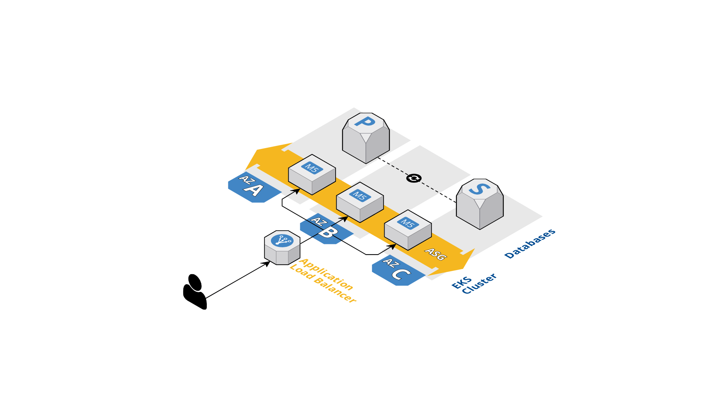

## **Overview**

Our hypothetical web application is a bulletin board that allows anonymous users to create and share posts with the internet. The application needs to be highly available, scalable, and secure to handle a potentially large number of concurrent users.

## **Network Diagram**



The above network diagram depicts a high-level design of the infrastructure for the web application using Kubernetes.

The infrastructure spans all three AZs. In each AZ, the cluster is spread across two subnets (public and private). The public subnet is for resources that need to be publicly accessible, such as the load balancer, and the private subnet is for resources that should not be directly accessible from the internet, such as the Kubernetes nodes and the database.

The load balancer is application load balancer that automatically provisioned by AWS Load Balancer Controller in the Kubernetes cluster, that distributes traffic to the Kubernetes nodes running the web application. The database is a managed service, such as Amazon RDS, that runs in a private subnet and is accessible only from within the Kubernetes cluster.

To ensure the infrastructure is scalable and highly available, we use Kubernetes features such as horizontal pod autoscaling, cluster autoscaling, and pod disruption budgets. These features can help the infrastructure automatically adjust to changes in traffic and resource availability.

To ensure the infrastructure is secure, we use Kubernetes security features such as RBAC, network policies, and pod security policies. We can also implement additional security measures such as encryption, SSL/TLS, and intrusion detection and prevention systems (IDS/IPS).

Overall, this design provides a scalable, highly available, and secure infrastructure for our hypothetical web application.

## **Required Resources**

The infrastructure for the web application will require the following resources:

- Kubernetes cluster
  - Kubernetes version: 1.21
  - Minimum instances: 3
  - Instance type: M5.large
  - Node autoscaling
- Load balancer
  - Automatically provisioned by ALB controller in Kubernetes
- Database
  - Engine: MySQL
  - Version: 5.7
  - Instance type: db.t2.medium
  - Multi AZ

## **Deployment**

### Prerequisites

- Git 2.0+
- NodeJS 16.19+ and npm
  - Preferably use NVM
- Terraform CLI 1.2+
- CDK for Terraform CLI 0.15.5+

### Install Packages

We neeed to install all the required npm packages before proceeding to other steps

```bash
$ npm install

added 303 packages, and audited 358 packages in 4s

37 packages are looking for funding
  run `npm fund` for details

found 0 vulnerabilities
```

### List Infra

To list the infra, run following command. Please wait until `cdktf` finish Synthesizing process.

```bash
$ cdktf list
Stack name                               Path
dev                                      cdktf.out\stacks\dev
stage                                    cdktf.out\stacks\stage
prod                                     cdktf.out\stacks\prod
```

### Deploy Infra

Before you can deploy the infra, make sure you have logged in to AWS CLI and have enough permission. After that, run following command

```bash
$ cdktf deploy <stack name>
$ cdktf deploy dev
Initializing the backend...

Successfully configured the backend "local"! Terraform will automatically
     use this backend unless the backend configuration changes.
     Initializing modules...

dev
dev  Downloading registry.terraform.io/cloudposse/rds/aws 0.41.0 for db...
dev  - db in .terraform\modules\db
dev  Downloading registry.terraform.io/cloudposse/route53-cluster-hostname/aws 0.12.2 for db.dns_host_name...
dev  - db.dns_host_name in .terraform\modules\db.dns_host_name
dev
...
...

1 Stack deploying     0 Stacks done     0 Stacks waiting
```

Once finished, choose Approve to apply the changes or Dismiss to cancel the process

```bash
Saved the plan to: plan

                   To perform exactly these actions, run the following command to apply:
                   terraform apply "plan"

Please review the diff output above for typescript-docker
❯ Approve  Applies the changes outlined in the plan.
  Dismiss
  Stop
```

### Create New Infra

To create another infra, edit the `src/main.ts` and add new `InfraStack` instance before the `app.synth()` method.

```tsx
...

new InfraStack(app, "qa", {
  name: "qa",
  environment: "staging",
  region: "eu-north-1",
});

app.synth();
```

After you save the file, verify the stack name before deploying the infra.

```tsx
$ cdktf list
...
qa                                       cdktf.out\stacks\qa
```

```tsx
$ cdktf apply qa
```

### Destroy Infra

To cleanup the infra, run following command.

```tsx
$ cdktf destroy qa
...

Destroy complete! Resources: 1 destroyed.
qa
```
